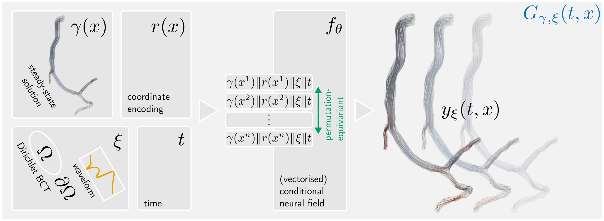

# Deep vectorised operators

[](https://www.sciencedirect.com/science/article/pii/S016926072500375X)

This repository contains the official implementation of **Deep vectorised operators for pulsatile hemodynamics estimation in coronary arteries from a steady-state prior** ([arXiv](https://arxiv.org/abs/2410.11920)).

<p align="center">
  
</p>

## Installation
Please follow [these instructions](https://github.com/sukjulian/lab-gatr?tab=readme-ov-file#installation) to set up a working PyTorch Geometric / xFormers environment. Next, install PointNet++ via
```shell
pip install git+https://github.com/sukjulian/pytorch-dvf.git
```
as well as some utility packages
```shell
pip install meshio prettytable trimesh[easy] potpourri3d h5py
```
and you should be good to go.

## Citation
If you found deep vectorised operators useful, please cite:
```
@article{DeepVectorisedOperators,
  title = {Deep vectorised operators for pulsatile hemodynamics estimation in coronary arteries from a steady-state prior},
  journal = {Computer Methods and Programs in Biomedicine},
  volume = {271},
  pages = {108958},
  year = {2025},
  issn = {0169-2607},
  doi = {https://doi.org/10.1016/j.cmpb.2025.108958},
  url = {https://www.sciencedirect.com/science/article/pii/S016926072500375X},
  author = {Julian Suk and Guido Nannini and Patryk Rygiel and Christoph Brune and Gianluca Pontone and Alberto Redaelli and Jelmer M. Wolterink}
}
```
